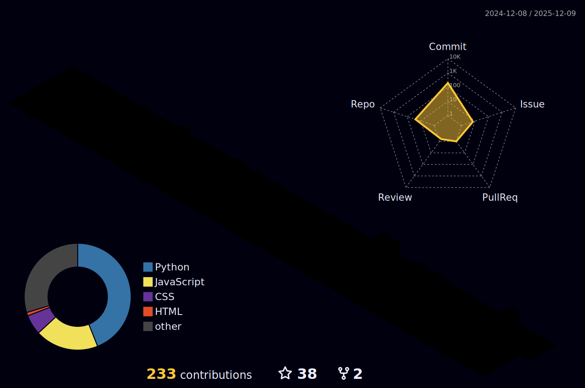

---

### About Me :)
- I have a deep interest in **algorithms**, **machine learning**, and **software optimization**.
- I'm open to collaborating on projects related to **algorithmic and complex problem-solving**.
- You can reach me anytime via email: **zakafakhri_outb@outlook.de**
- https://medium.com/@zakariaefakhri

### My techstack

### Frontend  
 
 
 

### Backend & Frameworks  
 
 

### Databases  
 
 
 

### Languages  
 
 
 

### DevOps & Tools  
 
 
 

### Cloud & OS  
 
 
 

### My statistics

<h3 align="left">Connect with me:</h3>

  
  &nbsp;&nbsp;
  

---
